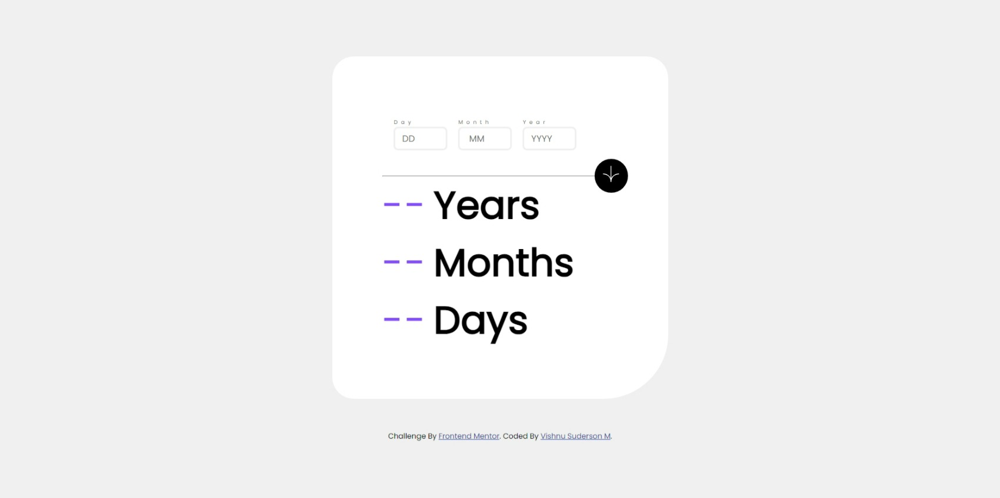

# Frontend Mentor - Age calculator app solution

This is a solution to the [Age calculator app challenge on Frontend Mentor](https://www.frontendmentor.io/challenges/age-calculator-app-dF9DFFpj-Q). Frontend Mentor challenges help you improve your coding skills by building realistic projects. 

## Table of contents

- [Overview](#overview)
  - [The challenge](#the-challenge)
  - [Screenshot](#screenshot)
  - [Links](#links)
- [My process](#my-process)
  - [Built with](#built-with)
  - [What I learned](#what-i-learned)
- [Author](#author)

## Overview

### The challenge

Users should be able to:

- View an age in years, months, and days after submitting a valid date through the form
- Receive validation errors if:
  - Any field is empty when the form is submitted
  - The day number is not between 1-31
  - The month number is not between 1-12
  - The year is in the future
  - The date is invalid e.g. 31/04/1991 (there are 30 days in April)
- View the optimal layout for the interface depending on their device's screen size
- See hover and focus states for all interactive elements on the page

### Screenshot




## My process

### Built with

- Semantic HTML5 markup
- CSS custom properties
- Flexbox
- CSS Grid
- Mobile-first workflow


### What I learned
 I 

```html
<form onsumbit="sumbit(event)">
<input type=text patterns="[1-9]{2}"/>
```
age calualtion algorithm
```js
function sumbit(e){
   e.preventDefault();
   Months=[31,28,31,30,31,30,31,31,30,31,30,31]
    if((Day.value)>currentdate){
        currentdate=currentdate+Months[month-1];
        currentmonth--;
    }
    if((month.value)>currentmonth){
        currentmonth=currentmonth+12
        currentyear--;
    }
    console.log(currentmonth);
    years.innerHTML=currentyear-Years.value;
    months.innerHTML=currentmonth-month.value;
    days.innerHTML=currentdate-Day.value;}
```
data getting function
```js
const date=new Date()
let currentdate=date.getDate()
let currentmonth=date.getMonth()+1
let currentyear=date.getFullYear()
```

## Author

- Linkdin - [vishnu suderson](https://www.your-site.com)
- Frontend Mentor - [@vishnu suderson](https://www.frontendmentor.io/profile/vishnusuderson)
---
<h1><a href="https://vishnusuderson.github.io/birthday-calculator/">Live links</a></h1>
